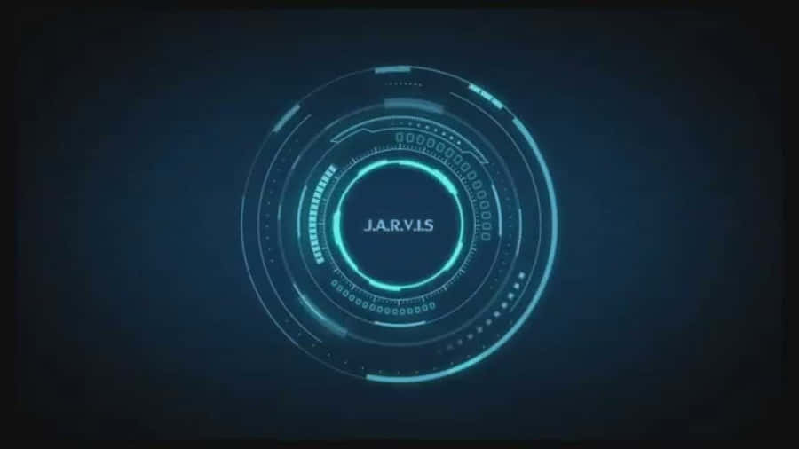
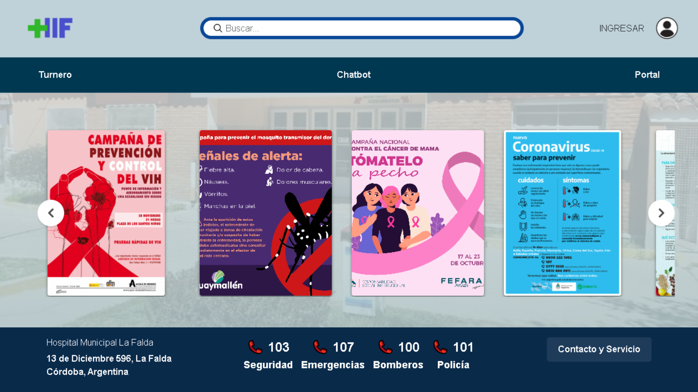

# Hi there 👋, I'm **Jordan Iralde**  

### 🧑‍💻 **Aspiring Developer** | Python Enthusiast | AI & Robotics Explorer  

Welcome to my GitHub! 🚀 I'm Jordan, a passionate developer diving into the fascinating worlds of **Artificial Intelligence**, **Robotics**, and **Machine Learning**. I love building solutions that can make a real impact, and I’m always open to collaborating and learning new things. Check out my projects below and join me on my journey!

🌟 **Currently Learning**: Docker, Kotlin, TensorFlow, PyTorch, Reinforcement Learning, IoT  
🎯 **Goals**: Build smarter AI systems, explore advanced robotics, and create impactful IoT solutions  

---

## 🚀 **Featured Projects**  

Here are some of my most exciting and innovative projects. Feel free to explore, contribute, or give feedback!  

### 1. <a href="https://github.com/Jordan-Iralde/ProBestoJarvisAI"> ProBestoJarvisAI: Your Personal AI Assistant </a> 🤖  

Welcome to **ProBestoJarvisAI**, an advanced Python-based AI Assistant designed to make your life easier. With **Natural Language Processing (NLP)** and **voice recognition**, this AI helps manage tasks, schedule reminders, and even engage in conversations.  

🔧 **Technologies**:  
- Python, NLP, Speech Recognition  
- Machine Learning, Flask, Docker, SQLite  

**Key Features**:  
- 🗣️ **Voice Recognition**: Interact with Jarvis through voice commands  
- 📝 **Task Management**: Create, update, and delete tasks effortlessly  
- 🔔 **Reminder System**: Set reminders for important tasks  
- 📅 **Calendar Integration**: Sync tasks with your calendar  

> **🌟 Star it if you find it useful!** ⭐  

---

### 2. <a href="https://github.com/Teresani/Integracio_de_paginas"> Hospital de La Falda </a> 🏥🌐  

A comprehensive, user-friendly website designed for **La Falda Hospital**, providing a seamless experience for both patients and staff. This project aims to improve hospital accessibility and efficiency with a modern web solution.  

🔧 **Technologies**:  
- HTML, CSS, JavaScript  
- Angular
- Django

**Key Features**:  
- 🩺 **Appointment Booking**: Patients can book, reschedule, or cancel appointments online  
- 📄 **Medical Records**: Secure access to patient medical histories for doctors and authorized personnel  
- 📢 **Announcements**: Hospital updates and important notices displayed dynamically  
- 📱 **Responsive Design**: Works seamlessly across all devices  

---

### 3. **[Crazy Chicken (Coming June 28)](https://github.com/Jordan-Iralde/Crazy-Chicken)** 🐔🎮  

Get ready for the wackiest adventure! **Crazy Chicken** is an exciting action-adventure game where players guide a mischievous chicken on a mission to escape from a chaotic farm filled with challenges, enemies, and puzzles.  

🔧 **Technologies**:  
- Unity, C#  
- Blender (3D Modeling), Photoshop (Textures)  

**Key Features**:  
- 🎮 **Engaging Gameplay**: Navigate through levels filled with quirky obstacles and surprises  
- 🐓 **Unique Characters**: Meet eccentric farm animals with their own personalities  
- 🧩 **Challenging Puzzles**: Solve creative puzzles to progress through the story  

Stay tuned for its release on **June 28**, and don't miss the chance to join the fun!  

---

## 🔧 **Technologies & Tools**  

- **Languages**: Python, JavaScript, C++, HTML, CSS, SQL  
- **Frameworks**: Angular, React, Node.js  
- **Databases**: MySQL, MongoDB
- **AI/ML**: TensorFlow, PyTorch, Scikit-learn   

---

## 📊 **GitHub Stats & Activity**  

  
  

---

## 🌱 **I’m Looking to Collaborate on**  

- **AI/ML Projects**: NLP, Computer Vision, Reinforcement Learning  
- **Robotics**: Autonomous systems, ROS  
- **IoT Applications**: Smart homes, environmental monitoring, automation  

---

## 📫 **Let’s Connect**  

- **LinkedIn**: [Jordan Iralde](https://www.linkedin.com/in/jordan-iralde/)  
- **Kaggle**: [Michi Critico](https://kaggle.com/michi)  
- **Email**: [iraldejordan10@gmail.com](mailto:iraldejordan10@gmail.com)  

---

## 💬 **Ask Me Anything**  
<figure><embed src="https://wakatime.com/share/@24a66571-28fb-493e-90b7-dafc0e06d743/a98f7731-5398-4444-ae26-8d0a49a2adc9.svg"></embed></figure>

Feel free to drop questions, feedback, or suggestions. Let’s chat! 😊  
